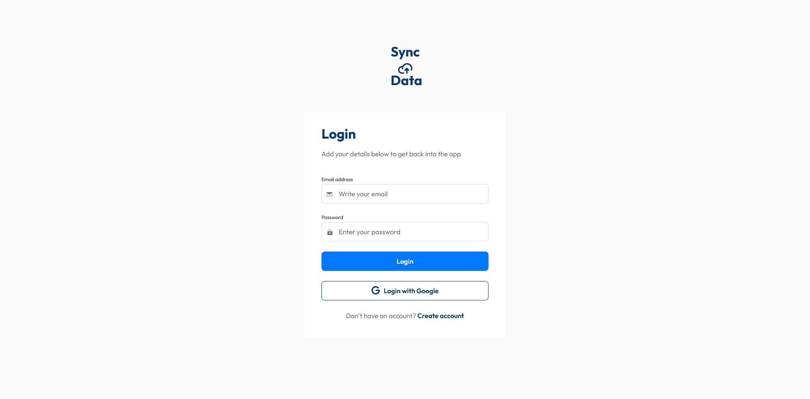
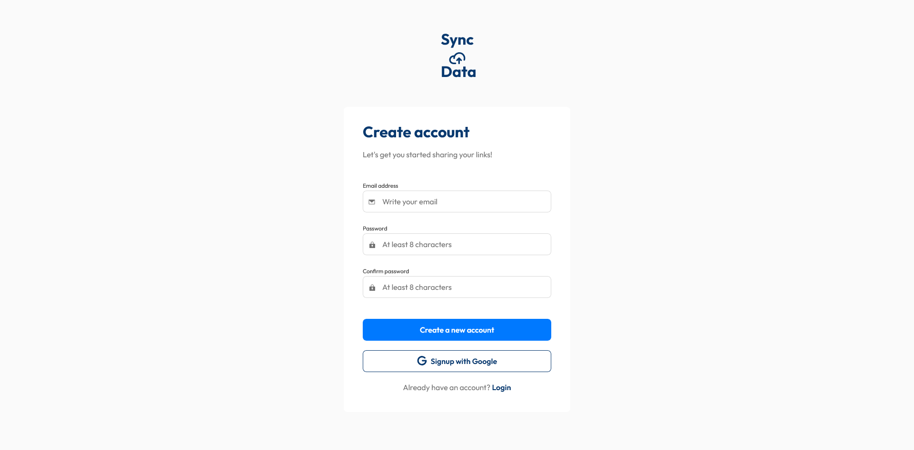
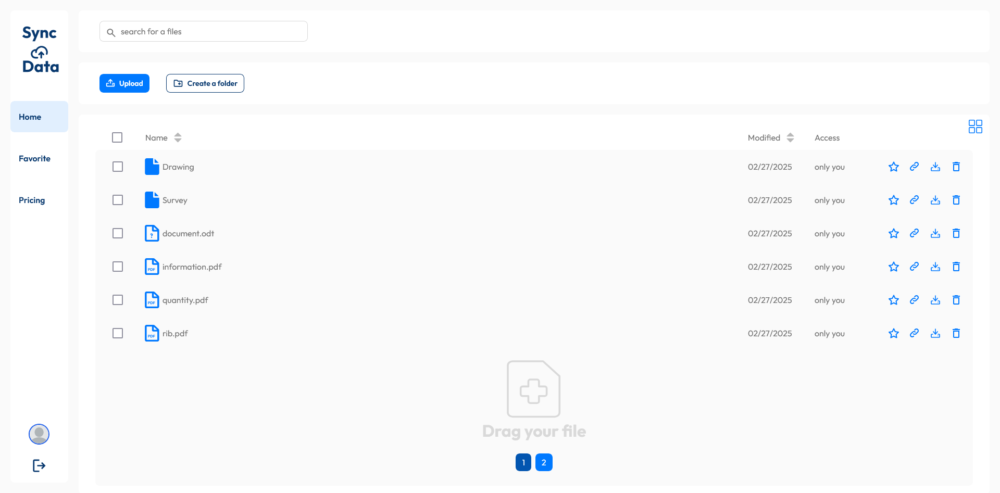
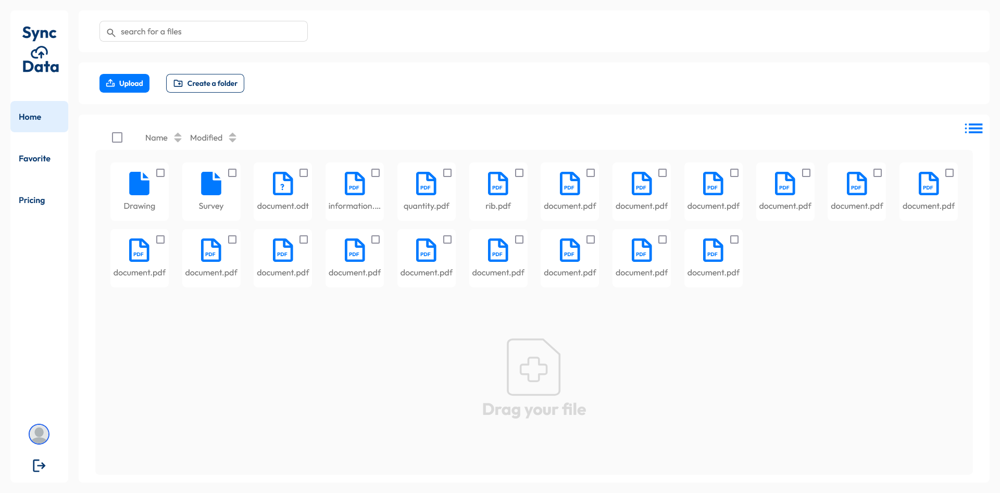
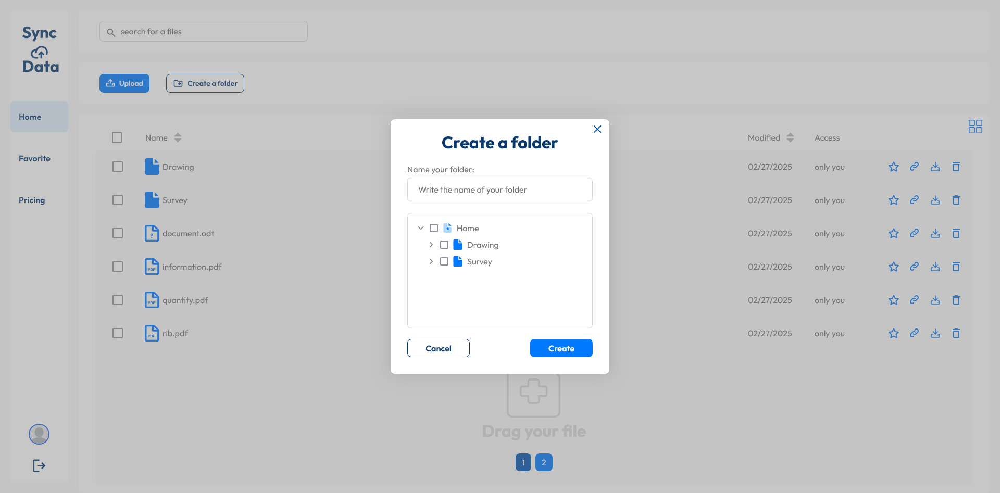
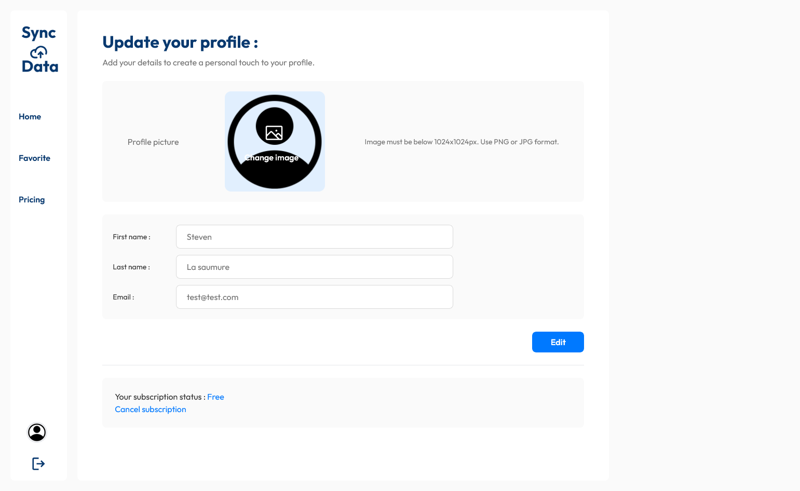

# Syncdata - Cloud Storage Application

A full-stack cloud storage application built with Next.js, TailwindCSS, Node.js and Mongodb that allows users to upload, organize, share and manage their files.

## Table of contents

- [Overview](#overview)
  - [Usage details](#usage-details)
  - [Screenshot](#screenshot)
  - [Links](#links)
- [My process](#my-process)
  - [Try](#try)
  - [Built with](#built-with)
  - [Key Features](#key-features)
  - [What I learned](#what-i-learned)
  - [Continued development](#continued-development)
- [Author](#author)

## Overview

### Usage details

The user can:

- Create folders and upload files to organize their data
- Drag and drop files to upload them
- Navigate through folder hierarchies easily
- Mark files as favorites for quick access
- Search and filter files by name and type
- Sort files by different criteria (name, date, etc.)
- View files in both list and grid layouts
- Manage files with basic operations (rename, delete, etc.)
- Manage their profile (edit firstname, lastname, picture and email)

### Screenshot








### Links

- Live Site URL: [SyncData](https://syncdata.vercel.app/)

## My process

### Try

You can create your own account or test the application with these credentials:

```bash
email: test@test.com
```

```bash
password: 0000
```

### Built with

- Next.js 14
- TypeScript
- Zustand for state management
- MongoDB for data storage
- TailwindCSS for styling

### Key Features

- **File Management**

  - Hierarchical folder structure
  - File upload and organization
  - Favorite files system
  - Search and filter capabilities

- **User Interface**

  - Responsive design
  - List/Grid view toggle
  - Drag and drop support
  - Real-time updates

  - **User Profile**

  - Edit user profile details (name, email, etc.)
  - Update profile image

- **Security**

  - JWT authentication
  - Protected routes
  - Secure file access

### What I learned

- Advanced state management with Zustand
- File system operations in Next.js
- MongoDB integration and data modeling
- Cloud storage implementation
- TypeScript best practices

### Continued development

- Add stripe subscription for premium features
- Implement file sharing between users
- Add file preview capabilities
- Add collaborative features

## Author

- Github- [Github](https://github.com/Stv-devl)
- LinkedIn - [LinkedIn](https://www.linkedin.com/in/stevan-l-793141128/)
- Portfolio - [Portfolio](https://www.stevandev.com/)
